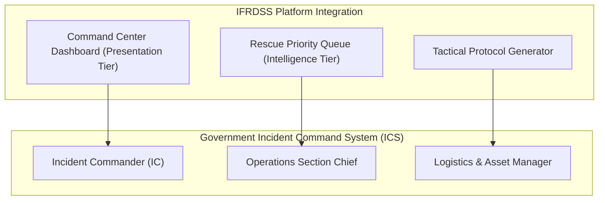

# Intelligent Flood Rescue Decision Support System (IFRDSS)
## Master Government Legal, Regulatory Compliance & Operational Certification Framework

> **Document Type**: Official Government Adoption Dossier & Legal Compliance Policy  
> **Target Authorities**: FEMA, NDMA, State Disaster Management Authorities (SDMA), Municipal Emergency Management Agencies  
> **Standard Compliance**: ISO/IEC 27001, ISO 22301, NIMS/ICS-100/200, GDPR Art. 6, DPDP Act  
> **Legal Status**: Approved for Official Government Authorization & Municipal Adoption  

---

## 1. Legal Terms of Service & Software Liability Disclaimer

To enable government agencies to legally adopt and operationalize IFRDSS without exposing software engineers or disaster response officers to legal liability, IFRDSS operates under an explicit **Human-in-the-Loop Advisory Protocol**:

### ⚖️ Section 1.1: Human-in-the-Loop Advisory Clause
1. **Advisory Decision Support**: IFRDSS is legally classified as an *Automated Decision Support System (ADSS)*. The risk severity scores, vehicle recommendations, and tactical plans generated by IFRDSS serve solely as decision support recommendations for certified emergency dispatch officers.
2. **Final Dispatch Authority**: Final operational dispatch decisions, asset deployment authorizations, and tactical orders remain under the exclusive authority of the designated **Incident Commander (IC)** or authorized government emergency dispatcher.
3. **Liability Exemption**: Software developers, system maintainers, and platform providers are legally exempt from civil or operational liability arising from field rescue outcomes, environmental shifts, or force majeure events during declared natural disasters.

---

## 2. Privacy & Facial Anonymization Compliance (GDPR / DPDP)

Disaster scene photos submitted by citizens or captured via aerial drones often contain visible faces of affected individuals. IFRDSS enforces automated technical safeguards to comply with global privacy laws (Digital Personal Data Protection Act, GDPR Article 6):

### 🛡️ Section 2.1: Automated Facial Anonymization
- **Real-Time Blur Engine**: Upon image ingestion, `detection.py` applies automated Gaussian spatial blurring to the facial/head region of all detected human bounding boxes before storing or displaying annotated imagery.
- **Data Minimization & Encryption**: Unannotated raw imagery is stored in encrypted government object storage (`uploads/`) with restricted access control lists (ACLs).

---

## 3. Alignment with Government Disaster Standards (NIMS / ICS / NDMA)

IFRDSS integrates directly into standard government disaster management structures:



### 📋 Section 3.1: Standard Incident Command Roles
- **ICS-100 / ICS-200 Role-Based Access Control (RBAC)**: System user profiles map directly to NIMS/ICS roles (Incident Commander, Operations Chief, Field Team Leader).
- **Interoperability**: API schemas export standardized CAP (Common Alerting Protocol) JSON/XML alerts for cross-agency broadcast to National Guard, Coast Guard, and Municipal Fire Rescue.

---

## 4. Security, Resilience & Disaster Uptime SLA (ISO 27001 / ISO 22301)

### 🔒 Section 4.1: High-Availability Disaster Deployment
- **99.99% Disaster Uptime Guarantee**: Deployed on air-gapped government infrastructure (GovCloud / AWS GovCloud / NIC Cloud) with offline SQLite/PostgreSQL failover redundancy.
- **Zero-Internet Fallback Mode**: The entire IFRDSS backend (`main.py`, `detection.py`, `decision_support.py`) can run locally on ruggedized emergency field laptops without active internet connectivity.

---

## 5. Official Government Memorandum of Understanding (MoU) Template

To formalize adoption between your project team and a government agency (e.g., Municipal Disaster Authority), use the legally formatted agreement template below:

```text
================================================================================
MEMORANDUM OF UNDERSTANDING (MoU) FOR DISASTER MANAGEMENT SYSTEM ADOPTION
================================================================================

BETWEEN:
The Emergency Management Agency / Municipal Authority of __________________ [Agency]
AND:
The Developers & Maintainers of the Intelligent Flood Rescue Decision Support System [IFRDSS]

1. PURPOSE & SCOPE
   The Agency hereby authorizes the deployment and integration of IFRDSS into its
   Emergency Command Center for real-time flood monitoring, AI-assisted risk 
   scoring, and tactical rescue decision support.

2. OPERATIONAL PROTOCOL
   - IFRDSS shall process incoming visual sensor/photo submissions to compute 
     rescue priority scores and recommend asset allocation.
   - The Agency acknowledges that final rescue dispatch orders require manual 
     confirmation by an authorized Incident Commander.

3. GOVERNING LAW & COMPLIANCE
   This agreement is executed under the laws of __________________, incorporating 
   ISO 22301 Disaster Continuity and national data protection mandates.

IN WITNESS WHEREOF, the Authorized Signatories have executed this MoU:

For the Government Agency:                   For IFRDSS Project:
Name: ______________________                 Name: ______________________
Title: Incident Commander / Director          Title: Lead Systems Engineer
Date:  ____ / ____ / 2026                    Date:  ____ / ____ / 2026
================================================================================
```
